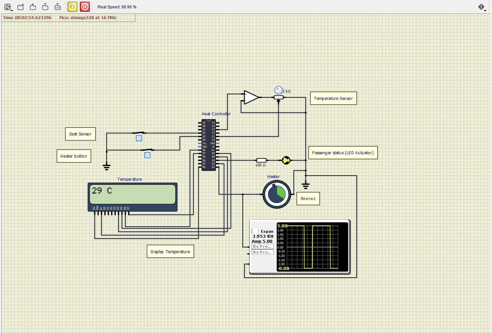

# EmbeddedC

## Simulation

- Both the switches are OFF, so the LED and Heater is turned OFF.

  

- The seat sensor is turned ON while the heater button is OFF, LED glows since the person is seated in the car but heater is turned OFF.

  

- The heater button is turned ON while the seat sensor is ON, both the LED and Heater is turned OFF because the person has exited the vehicle.

  

- Both the switches are ON, Led glows and Heater is ON,

  - The temperature is at 20°C
    
  - The temperature is at 25°C
    
  - The temperature is at 29°C
    
  - The temperature is at 33°C
    

- Transmitting data to another device using UART is shown in the serial monitor.

  

## Makefile contents

- `make` - To create hex and elf file in build folder.

  **Note**: The build file is automatically created once you have run the make function.

- `make clean` - To clean the build folder from the directory.
